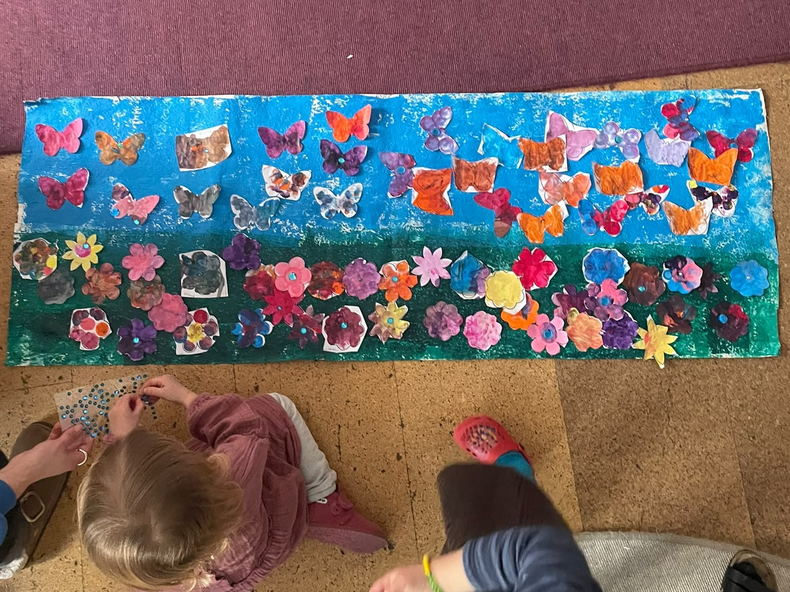
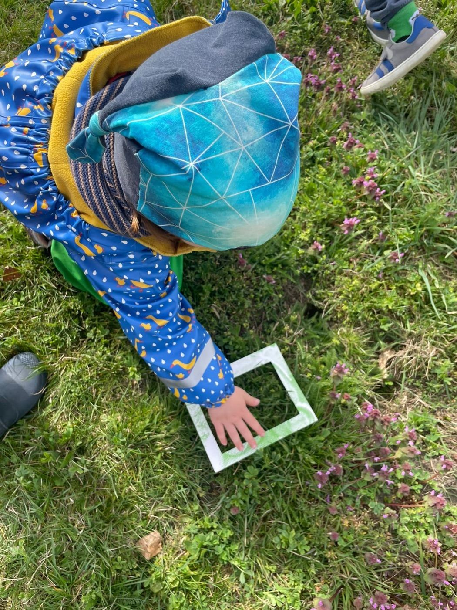
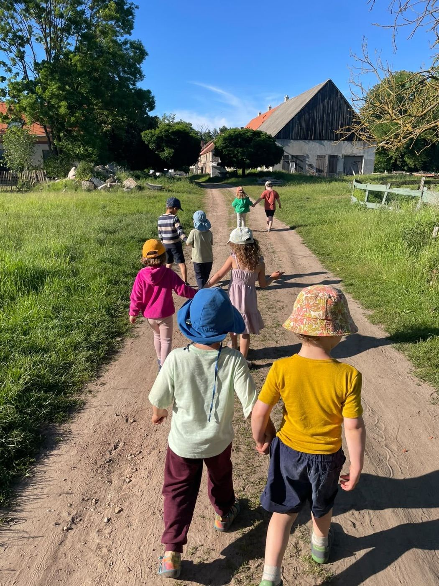

{ width=100% }

## Hallo liebe Familien!

Wir sind der Elterninitiativ-Kinderladen »Die Kinkies« e.V.

Unsere Adresse lautet:

> EKT »Die Kinkies« e.V. \
> Weisestr. 4 \
> 12049 Berlin-Neukölln \
> Tel.: 030 89655951 (Bitte keine Platzanfragen) \
> Email: <vorstand.kinkies@gmail.com>

Der Kinderladen hat wochentags geöffnet von 8:00 bis 16:30 Uhr.

Wendet euch bei Platzanfragen bitte an unsere Email-Adresse.

Wir suchen immer wieder nach Honorarkräften, die in Krankheitsfällen oder
ähnlichem bei uns aushelfen können. Bei Interesse schickt bitte eine Mail.

## Wir sind die Kinkies

\

Wir betreuen Kinder von 1 bis 6 Jahren und unser pädagogisches Team besteht aktuell aus 4 Erzieherinnen, sowie einer Erzieherin als Quereinsteigerin, einer Erzieherin in Ausbildung und einer Köchin. Außerdem unterstützen uns bei Bedarf unsere tollen Honorarkräfte.

Die Betreuung bei den Kinkies zeichnet sich durch einen besonders guten Betreuungsschlüssel aus, welcher es unseren Erzieherinnen ermöglicht, auf die individuellen Bedürfnisse der Kinder einzugehen und z.B. regulär Aktivitäten nach Wunsch der Kinder in kleinen Gruppen anzubieten. 

Eine engagierte Elternschaft ist uns wichtig. Gemeinsam sorgen wir dafür, dass es für alle im Laden schön ist. 

Wir arbeiten ohne pädagogische Leitung und setzen im Team auf Eigeninitiative. Wir arbeiten nach dem Berliner Bildungsprogramm und einem situationsorientierten, gendersensiblen und inklusiven Ansatz.

Unsere Köchin verwöhnt uns mit selbst gekochtem, vegetarischem Bio-Essen.

Unser Kinderladen liegt im schönen Schillerkiez in Neukölln, von wo sowohl die Hasenheide als auch das Tempelhofer Feld gut zu erreichen sind. Er ist in einer großen, hellen Ladenwohnung untergebracht. Zur Verfügung stehen den Kindern drei große Räume für verschiedene Aktivitäten sowie ein Schlafraum.

## Was wir unternehmen

::: {.gallery}
 
:::

In unserem Alltag gehen wir regelmäßig und gerne raus und machen längere Ausflüge z.B. in die Hasenheide oder auf das Tempelhofer Feld. Einmal in der Woche kommt ein Musiker zum gemeinsamen Musizieren. Ansonsten lassen wir den Kindern viel Raum für selbstbestimmtes Spielen und Lernen.

Neben dem täglichen Angebot aus den unterschiedlichen Spielmöglichkeiten, die der Laden bietet, gibt es eine Reihe von Aktivitäten, die den Kindern von den Erzieherinnen als Angebot gemacht werden:

* Theater: Wir nutzen gern die unterschiedlichen Möglichkeiten unseres Kiezes, ins Theater zu gehen.
  
* Kinderladenübernachtung und Kinderladenreise: Einmal im Jahr finden diese Highlights für die ab 3-Jährigen statt

* Natur & Forschen: Ab und zu geht’s ins Forscherzelt auf dem Tempelhofer Feld

* Bewegung: Wir besuchen regelmäßig die Bewegungsbaustelle im Schillerkiez

* Weitere Angebote wie Kino, Ludothek, Cafébesuche sowie spezielle Angebote für die Vorschulkinder kommen noch dazu

Wenn ihr uns kennenlernen möchtet, schreibt uns eine Email und kommt auf ein Treffen vorbei!

::: {.footer}
Vereinsregister: Amtsgericht Charlottenburg VR9456B
:::

